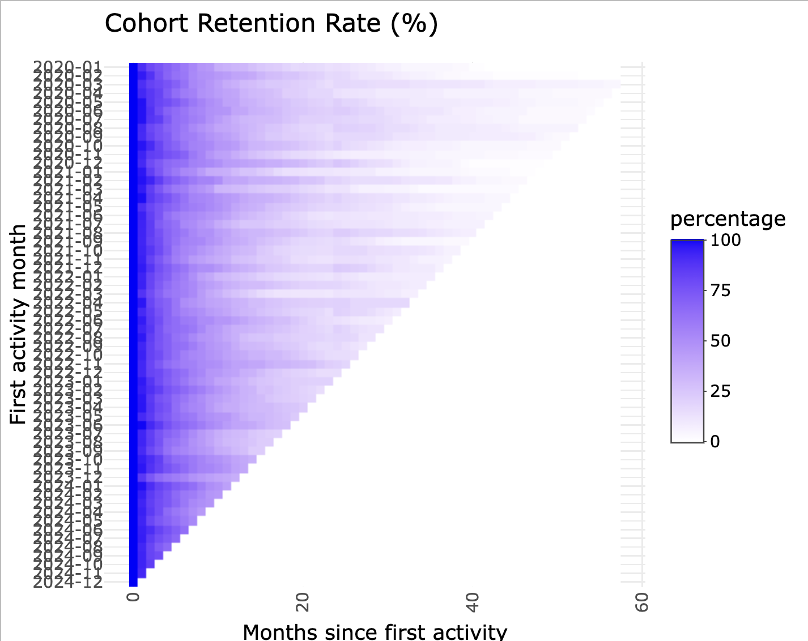

# UserActivity

Based on user activity data, this package provides functions to study user
activity.

## Installation

``` r
> install.packages("devtools")
> devtools::install_github("cassiopagnoncelli/useractivity")
```

## Usage

**Cohort**

Build a user activity feed in the same xts format as `user_activity`,
transform into a cohort matrix and plot the cohort analysis.

``` r
> library(useractivity)

> data("user_activity")

> matrix <- cohort_matrix(user_activity)
> plot_cohort(matrix)
```



## Further developments

1.  **Activation Trigger**: finding the activation trigger.
2.  **Retention analysis**: retention analysis.
3.  **Churn**: churn analysis.

## License

See [`LICENSE.md`](./LICENSE).
